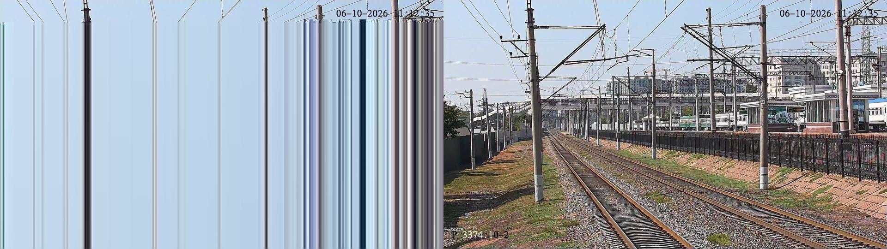

# SRT laboratoriya sinovi (1-bosqich, 2026-10-06)

**Savol:** kameradan serverga keladigan kanaldagi paket yo'qolishini SRT
yopadimi? Shunga qarab uchastkalarga "nasos" (mini-PC + SRT) qo'yish
qaror qilinadi.

## Nega kerak bo'ldi

Toshkent uchastkalarida (10.30.11, 10.30.17) ko'p kamera "online, lekin
ochilmaydi" yoki qotadi. O'lchovlar:

| Uchastka | Ping (1300 bayt) | Yo'qotish |
|---|---|---|
| 10.30.11 | 46 ms | 0 % |
| 10.30.17 | 46 ms | 4 % |
| 10.30.37 | 49 ms | 2 % |

2–4 % yo'qotishli kanalda bitta TCP ulanish ~1,3–1,8 Mbit/s dan oshmaydi,
kameraning asosiy oqimi esa ~4,8 Mbit/s. TCP "och" qoladi (8 s da 0–60
kadr), keyframe'lar yo'qoladi, tasvir ochilmaydi. UDP tezlikni ushlaydi,
lekin yo'qolgan paketlar tasvirni buzadi.

## Sinov qanday qilindi

- **Manba:** 3393/1 km ga o'xshash toza oqim — H.264, 2560×1440, 25 kadr/s,
  4,84 Mbit/s, keyframe har 2 s.
- **Kanal emulyatori:** UDP relay, har yo'nalishda 23 ms kechikish (RTT 46 ms)
  va berilgan ulushda tasodifiy paket tashlash — ikkala yo'nalishda ham
  (SRT'ning tasdiq/so'rov paketlari ham yo'qoladi).
- **Har sinov:** 40 s (1000 kadr kutiladi), FFmpeg 8.1, SRT bufer (latency) 400 ms.
- Skript: [`backend/scripts/srt_lab.py`](../backend/scripts/srt_lab.py).

## Natija

| Protokol | Yo'qotish | Kanal tashladi (paket) | Kelgan kadr | Dekodlash xatosi |
|---|---|---|---|---|
| UDP | 0 % | 0 | 1000 / 1000 | 20 ¹ |
| UDP | 2 % | 391 | 973 / 1000 | 72 |
| UDP | 4 % | 772 | 953 / 1000 | 125 |
| UDP | 8 % | 1311 | 876 / 1000 | 201 |
| **SRT** | **2 %** | 446 | **1000 / 1000** | **0** |
| **SRT** | **4 %** | 887 | **1000 / 1000** | **0** |
| **SRT** | **8 %** | ~1800 (3 urinish) | **1000 / 1000** | **0** |

¹ Qabul qiluvchi oqimning o'rtasidan (keyframe'dan oldin) ulangani — o'lchov
boshlanishi; qolgan UDP natijalari shu 20 ga nisbatan.

Bir xil paytdagi kadr — chapda UDP 4 %, o'ngda SRT 4 %:



## Xulosa

1. **SRT bizning kanaldagi yo'qotishni to'liq yopadi** — 8 % gacha (o'lchangan
   2–4 % dan ikki baravar ko'p) tasvir buzilmaydi.
2. **Narxi:** ~400 ms kechikish (kuzatuv uchun sezilmaydi) va kanalda ~17 %
   ko'proq trafik (qayta yuborishlar: 4 % da 21 753 paket, UDP 18 558).
   Uchastka kanalida shuncha zaxira bo'lishi kerak.
3. **Ehtiyot:** og'ir yo'qotishda ulanish (handshake) birinchi urinishda
   o'rnatilmasligi mumkin (8 % da 4 urinishdan 1 tasi). Haqiqiy o'rnatishda
   qayta ulanish yoqilgan bo'lishi shart (MediaMTX buni o'zi qiladi).
4. **Chegarasi:** SRT tasodifiy yo'qotishni yopadi, kanal TO'LIB qolishini
   emas. Kanal o'tkazuvchanligidan ko'p oqim yuborilsa, qayta yuborishlar
   vaziyatni og'irlashtiradi — uchastka bo'yicha oqim chegarasi baribir kerak.

## Keyingi qadam — 2-bosqich (maydonda)

Hamma uchastkalar o'lchovi (pastda) ko'rsatdi: yo'qotish uchastkalarda emas,
bizdan temir yo'lning Toshkent tuguniga (10.30.11.254) boradigan VPN tunnelda.
Shuning uchun sinov ham, keyingi o'rnatish ham — **bitta joyda**: Toshkent
tuguni yonida (tunnelning temir yo'l tomonida) noutbuk yoki virtual mashina.
Unda MediaMTX hamma uchastka kameralarini magistraldan tortib serverga SRT
bilan yuboradi. 3393/1 km va boshqalar oldin/keyin solishtiriladi.

Temir yo'l IT xizmatidan kerak: (1) Toshkent tuguni yonida joy (server
xonasida noutbuk yoki ularning serverida kichik VM) va bitta IP manzil;
(2) undan kamera tarmoqlariga (10.30.x) RTSP 554 ruxsati; (3) bizning
serverga UDP port (SRT). Ulardan so'rash kerak bo'lgan savol ham bor: VPN
tunnelidagi 1-8 % yo'qotish ular uchun ham normal emas — tunnel ostidagi
internet kanalini tekshirishlari mumkin.

## Hamma uchastkalar o'lchovi (2026-10-06, 12:40)

Har uchastkadan 2 ta onlayn kameraga 200 tadan 1300 baytli ping
([`backend/scripts/site_links.py`](../backend/scripts/site_links.py)):

| Uchastka | Hudud | Km | Kamera | Yo'qotish | RTT o'rt. | RTT p95 | Tebranish |
|---|---|---|---|---|---|---|---|
| 10.30.11 | Toshkent sh./vil. | 3372–3400 | 23 | 1,5 % | 41 ms | 48 ms | 6,6 ms |
| 10.30.17 | Toshkent vil. | 3402–3418 | 12 | 1,0 % | 42 ms | 50 ms | 6,6 ms |
| 10.30.21 | Toshkent vil. | 3420–3429 | 10 | 2,7 % | 42 ms | 50 ms | 6,7 ms |
| 10.30.25 | Sirdaryo/Toshkent | 3431–3455 | 8 | 3,7 % | 42 ms | 50 ms | 6,6 ms |
| 10.30.29 | Sirdaryo | 3458–3476 | 15 | 3,5 % | 42 ms | 50 ms | 6,4 ms |
| 10.30.31 | Sirdaryo | 3480–3488 | 12 | 2,2 % | 42 ms | 50 ms | 6,4 ms |
| 10.30.33 | Jizzax/Sirdaryo | 6–3558 | 11 | 1,7 % | 43 ms | 51 ms | 6,5 ms |
| 10.30.37 | Jizzax | 3565–3619 | 16 | 3,0 % | 43 ms | 51 ms | 6,6 ms |
| 10.30.45 | Jizzax/Samarqand | 3644–3718 | 20 | 2,7 % | 45 ms | 52 ms | 6,6 ms |
| 89.236.216 | NVR (ochiq internet) | — | 8 | 0 % | 5 ms | 11 ms | 2,9 ms |

Toshkentdan Samarqandgacha kechikish deyarli bir xil (41 → 45 ms) — demak u
uchastkalarda emas, umumiy yo'lda. `pathping` (100 so'rov, Samarqand kamerasigacha):

```
192.168.136.1 -> 10.173.1.214 -> 192.168.0.6       yo'qotish 0 %, ~1 ms
   == VPN tunnel ==                                yo'qotish 8 %, +39 ms   <- shu yerda
10.30.11.254 (temir yo'l Toshkent tuguni)
   -> 10.0.11.1 -> 10.0.45.2 -> 10.30.45.59         yo'qotish ~1 %, +0-5 ms
```

(10.0.11.1 va 10.0.45.2 ping'ga javob bermaydi — trafikni o'tkazadi.)

**Xulosa:** yo'qotish va kechikishning deyarli hammasi bizdan temir yo'lning
Toshkent tuguniga boradigan bitta VPN tunnelda. Temir yo'l magistralining
o'zi toza (~1 %, 0-5 ms). Shuning uchun 9 ta uchastka qurilmasi o'rniga
**bitta nasos** — Toshkent tuguni yonida (tunnelning temir yo'l tomonida) —
hamma ~130 kamerani yopadi: u kameralarni toza magistraldan oddiy RTSP/TCP
bilan oladi (RTT 1-5 ms da TCP och qolmaydi), tunneldan esa SRT bilan o'tkazadi.

Laboratoriya natijasi (yuqorida) bu parametrlarni to'liq qamraydi: RTT 46 ms,
yo'qotish 2 / 4 / 8 % — SRT uchalasida 1000/1000 kadr, 0 xato. Uchastkalar
o'rtasida farq yo'qligi sababli har biriga alohida laboratoriya qayta yuritilmadi.
